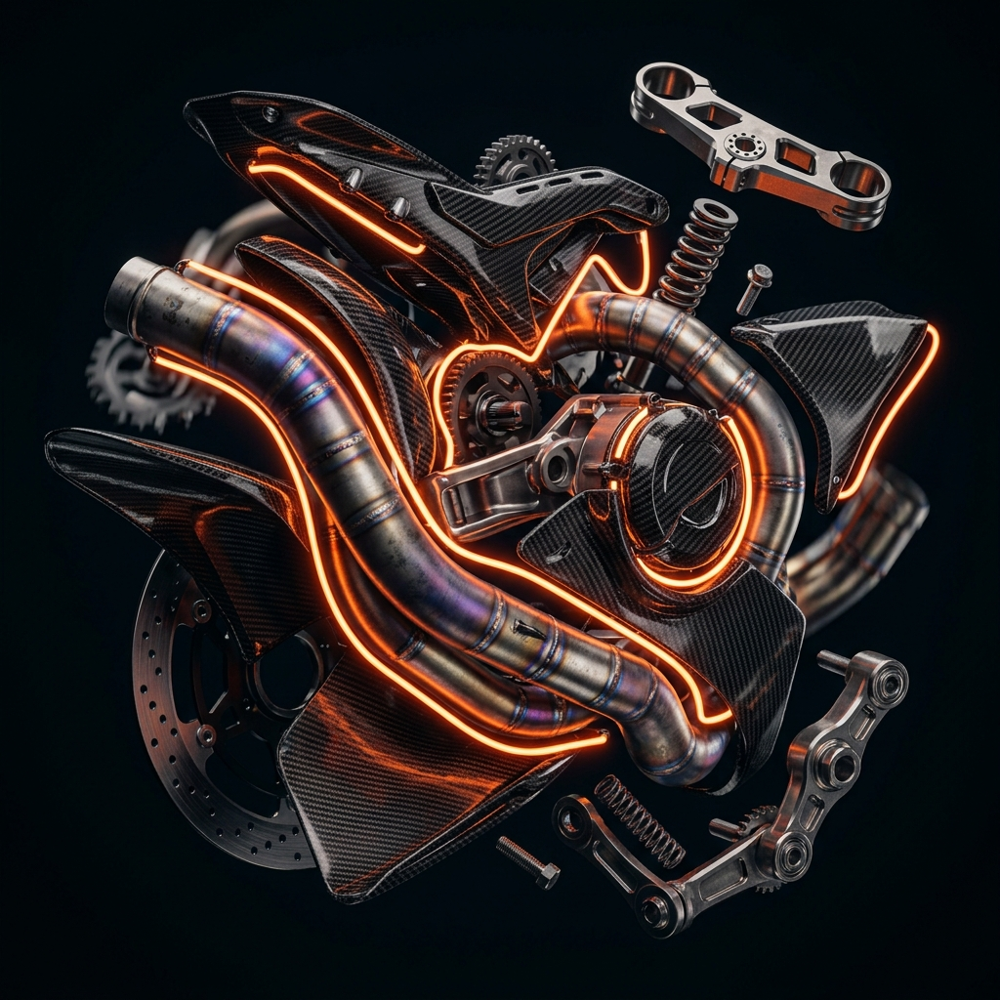

# 🏎️ ApexMoto: Tactical E-commerce & Racing Platform

**ApexMoto** is a premium, high-performance e-commerce platform designed for the modern rider. Built with a "Tactical Racing" aesthetic, it combines cutting-edge web technologies with a professional-grade user experience to modernize the motorcycle parts industry.



## 🚀 Key Features

### 🛠️ Custom Build Studio (Standout Feature)
A high-fidelity configurator that allows riders to customize their machines in real-time.
- **Visual Feedback**: Selection hotspots and part-swapping logic.
- **Real-time Valuation**: Instant price updates as components are added.
- **Mount-Safe Rendering**: Optimized for zero hydration errors in Next.js.

### 🗺️ Mechanical Finder (Shop Map)
A fully synchronized service locator powered by **Leaflet.js**.
- **Two-Way Synchronization**: Map markers pan the shop list, and list selections focus the map.
- **Integrated Booking**: A tactical slide-out panel for scheduling services with date/time pickers.

### 🛡️ ApexCommand (Admin Dashboard)
A mission-control style dashboard for inventory and shop management.
- **Critical Stock Alerts**: Real-time analytics and inventory health tracking using **Recharts**.
- **Tactical CRUD**: Rapid inventory and hub management with a glassmorphism UI.

### 🛒 High-Octane E-commerce
- **Premium Assets**: 8K cinematic renders of engine and drive components.
- **Tactical Filters**: Multi-layered brand and system filtering with "Clear All" functionality.
- **Fluid UX**: Framer Motion powered transitions and a persistent, glass-blur cart drawer.

## 💻 Tech Stack

- **Framework**: [Next.js 16](https://nextjs.org/) (App Router & Turbopack)
- **Styling**: [Tailwind CSS](https://tailwindcss.com/)
- **Animations**: [Framer Motion](https://www.framer.com/motion/)
- **Mapping**: [Leaflet](https://leafletjs.org/) & [React-Leaflet](https://react-leaflet.js.org/)
- **Analytics**: [Recharts](https://recharts.org/)
- **UI Components**: Radix UI / Shadcn UI
- **Icons**: Lucide React

## 🎨 Design Philosophy: "Tactical Racing"
The platform adheres to a strict design system:
- **Core Palette**: Deep Midnight (`#050505`) with Apex Orange (`#ff4d00`) accents.
- **Glassmorphism**: Heavy use of backdrop filters and border-glows to create a "Tactical" feel.
- **Cinematic Lighting**: Product assets rendered with dramatic studio lighting and neon reflections.

## 🔧 Installation & Setup

1. **Clone the repository**:
   ```bash
   git clone https://github.com/raptile007/apex-moto-new.git
   ```

2. **Install dependencies**:
   ```bash
   npm install
   # or
   pnpm install
   ```

3. **Run the development server**:
   ```bash
   npm run dev
   # or
   pnpm dev
   ```

4. **Access the platform**:
   Open [http://localhost:3000](http://localhost:3000) (or your configured port).

---

Built with ⚡ by **Antigravity AI** for **ApexMoto Racing Team**.
